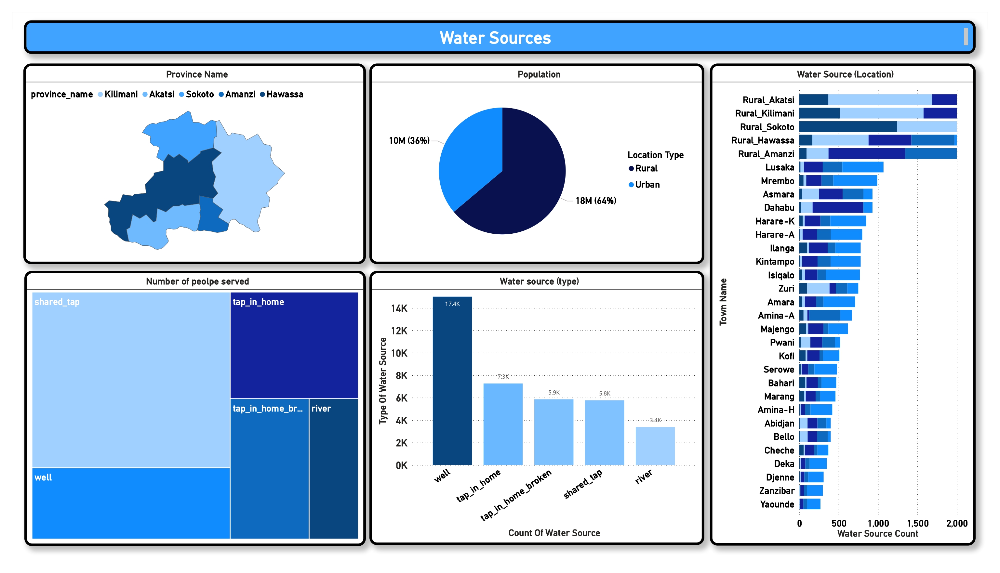
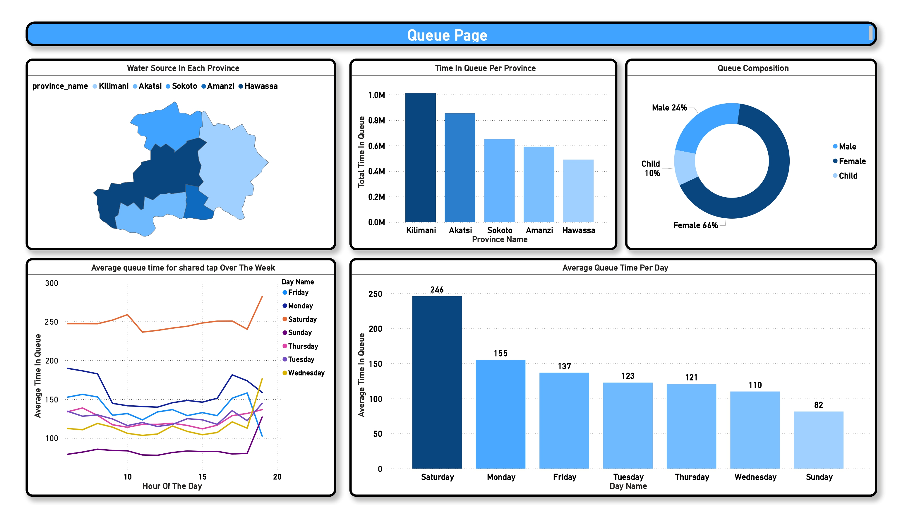
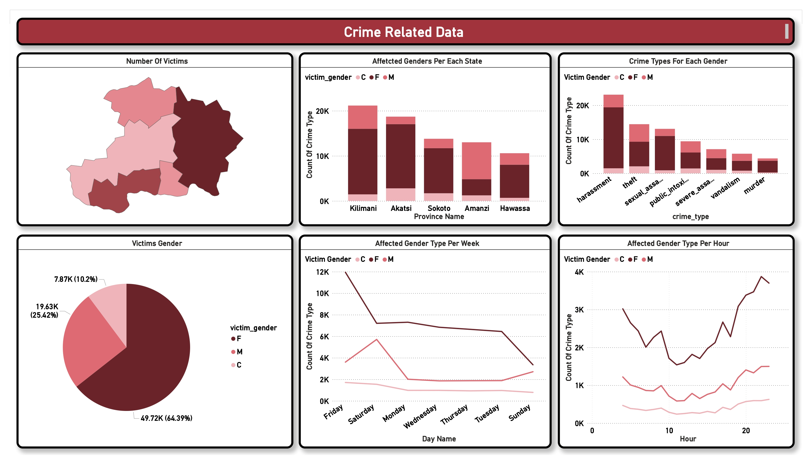
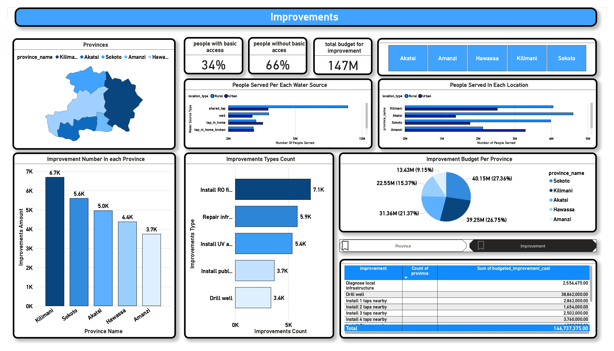
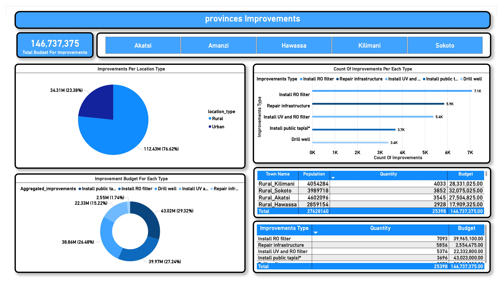
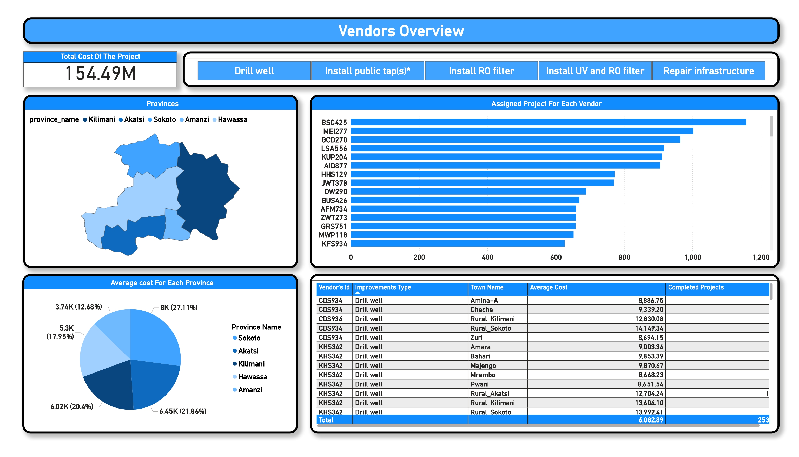

# Maji Ndogo Water Access and Infrastructure Project Analysis

**Prepared by:** [Yousef Emad Eldin]  
**Date:** [3/12/2024]  

---

## Executive Summary

This analysis evaluates the Maji Ndogo water access and infrastructure project, focusing on water accessibility levels, infrastructure improvements, and resource allocation. Using **Power BI** for data visualization and **MySQL** for data processing, we analyzed water access metrics, project completion rates, and geographical insights to support data-driven decision-making for improving water service delivery in underserved areas.

---

## Project Objectives and Scope

The project aims to:

1. **Evaluate Water Accessibility**: Assess the percentage of people with access to basic water services.
2. **Track Project Completion**: Analyze the status and completion rate of water infrastructure projects.
3. **Determine Budget Allocation**: Monitor costs by province and improvement type to ensure efficient fund distribution.
4. **Optimize Service Delivery**: Use geographical insights to improve infrastructure in underserved areas.

Data spans several years, emphasizing seasonal water demand patterns and infrastructure needs across regions.

---

## Data Sources and Preparation

### Data Sources:
- **Project Progress Database**: Records on project completion, town names, and improvement types.
- **Infrastructure Cost Database**: Costs associated with infrastructure improvements by category and province.
- **Demographic and Geographical Data**: Population served, province details, and distance data.

### Data Preparation Steps:
- **Standardizing Locations and Categories**: Merged inconsistent names for towns and improvement types.
- **Data Cleaning**: Removed duplicates and filtered out incomplete or canceled projects.
- **Budget Allocation Calculations**: Used **MySQL** to determine regional budget needs and categorize improvement types based on adjusted costs.
- **MySQL for Efficiency**: Migrated datasets to **MySQL** for real-time updates in **Power BI**, especially for regional distance and budgeting calculations.

---

## Data Overview

The data is organized into several key tables that represent different aspects of the water infrastructure and populations served. Below is an overview of the data structure:

### Tables

- **`water_sources`**: This table contains information about various types of water sources and the populations they serve. Key columns in this table include:
  - **`type_of_water_source`**: Describes the type of water source (e.g., shared tap, well, tap in home).
  - **`population_served`**: Represents the number of people served by each water source type.

- **`auditor_report`**: This table includes reports from auditors who assess water sources, infrastructure, or related conditions. It captures the results of these assessments, including scores and any observations.

- **`visits`**: Tracks visits to locations for monitoring or assessment purposes. This table records the dates and details of these visits.

- **`water_quality`**: Contains records related to the quality of water at various points in the infrastructure. It includes measurements, assessments, and any related observations about water quality.

### Schema Image

Below is an image representing the data schema, showing how the different tables are connected and organized:

This schema supports the analysis and reporting of water infrastructure, quality, and the populations served by different water sources.

---

## Key Metrics and Analytical Approach

### Key Metrics:
1. **Basic Water Access Level**: Percentage of people with access to water services across regions.
2. **Project Completion Rate**: Tracks the number of completed projects (currently at 29).
3. **Budget Allocation**: Costs analyzed by province and project type for efficient resource distribution.
4. **Population Reach**: Percentage of the population served, focusing on underserved regions.

### Analytical Approach:
- **Percentage Analysis**: Calculated water access percentages.
- **Geographical Segmentation**: Analyzed access levels and budgets at the provincial level.
- **Geographical Insights**: Identified gaps in water access for underserved areas.

---

## Visualizations and Insights for Each Dashboard Page

### 1. **Water Accessibility Overview**
  
**Description:**  
This page provides insights into water accessibility across provinces. Key metrics include the percentage of the population served by various water source types and comparisons between rural and urban areas. Visuals such as bar charts and maps highlight disparities in water accessibility and identify underserved regions.

---

### 2. **Queue Metrics Analysis**
  
**Description:**  
This page focuses on average queue times at shared taps, segmented by days of the week and hours of the day. Additional insights include the demographic composition of queue participants (male, female, children) and queue metrics per province.

---

### 3. **Water Pollution Analysis**
  
**Description:**  
This page examines water pollution across provinces. Visuals display pollution types (chemical, biological, clean) and specific contaminants affecting water quality. It also provides insights into the number of people affected in each province.

---

### 4. **Victim and Crime Data**
  
**Description:**  
This section analyzes affected gender groups and crime types related to water access issues. Key visuals include crime frequency by gender, day of the week, and hour of the day. Geographical distribution of affected populations is also included.

---

### 5. **Population and Improvements**
  
**Description:**  
This page covers population data and water source improvements by location type (rural or urban). It includes the number of people served per province, types of improvements made, and budget allocation for infrastructure.

---

### 6. **Cost and Budget Evaluation**
  
**Description:**  
This section evaluates project costs against budgets over time. It includes breakdowns by improvement type and province, visualizing cost trends and overall budget adherence.

---

### 7. **Cost and Budget Evaluation**
  
**Description:**  
This page highlights vendor performance, including the number of projects assigned and types of improvements completed by vendors. It also includes an overview of the average costs associated with improvements across provinces.

---

### 8. **Vendors Overview**
  
**Description:**  
This page provides detailed information on vendor assignments, including specific towns, improvement types, and project costs. It also outlines the total cost of projects managed by each vendor and their contributions to overall infrastructure improvements.

---

## Conclusion and Recommendations

Based on the analysis, the following steps are recommended:

1. **Prioritize High-Demand Provinces**: Focus on regions with low access percentages for new projects.
2. **Optimize Improvement Types**: Allocate funds to cost-effective project types based on provincial trends.
3. **Enhance Project Completion Strategies**: Streamline workflows to reduce delays and meet milestones.
4. **Invest in Localized Infrastructure**: Develop infrastructure tailored to the needs of underserved areas.

---

## Appendix

### DAX Formulas and Calculations:
- Water access percentage
- Project completion rate
- Cost breakdowns

### Data Transformation Notes:
- Standardization of categories
- Budget calculations
- MySQL optimizations

### Supporting Visuals:
- **Basic Water Access by Province**: Pie charts
- **Budget Allocation by Improvement Type**: Tables
- **Project Completion Tracking**: Interactive visuals

---

This README provides a comprehensive overview of the Maji Ndogo project’s progress and financial analysis. It aligns insights with strategic goals to help stakeholders achieve widespread water access in the region.
